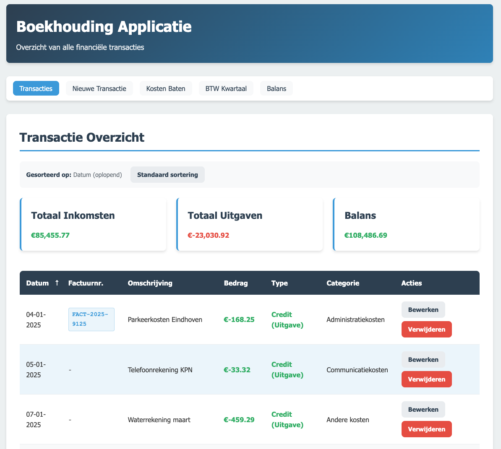

# boekhouden
Open source applicatie om administratie in te voeren.

## Installatie
1. Zorg ervoor dat MySQL geïnstalleerd is.
2. Maak een database aan en voer schema.sql uit.
3. Pas config.php aan met je database credentials.
4. Start een webserver (bijv. met php -S localhost:8000) en open index.php.

## Gebruik
- index.php: Overzicht van transacties
- add.php: Nieuwe transactie toevoegen
- edit.php: Transactie bewerken
- delete.php: Transactie verwijderen

[Bezoek Boekhouden met Fake data om uit te proberen](https://boekhouden.hodc.nl/)

## Voorbeeld
 - Onderstaande schermafbeeldingen geven een voorbeeld hoe de app werkt.
 - De voorbeelden zijn gebaseerd op Fake data.

