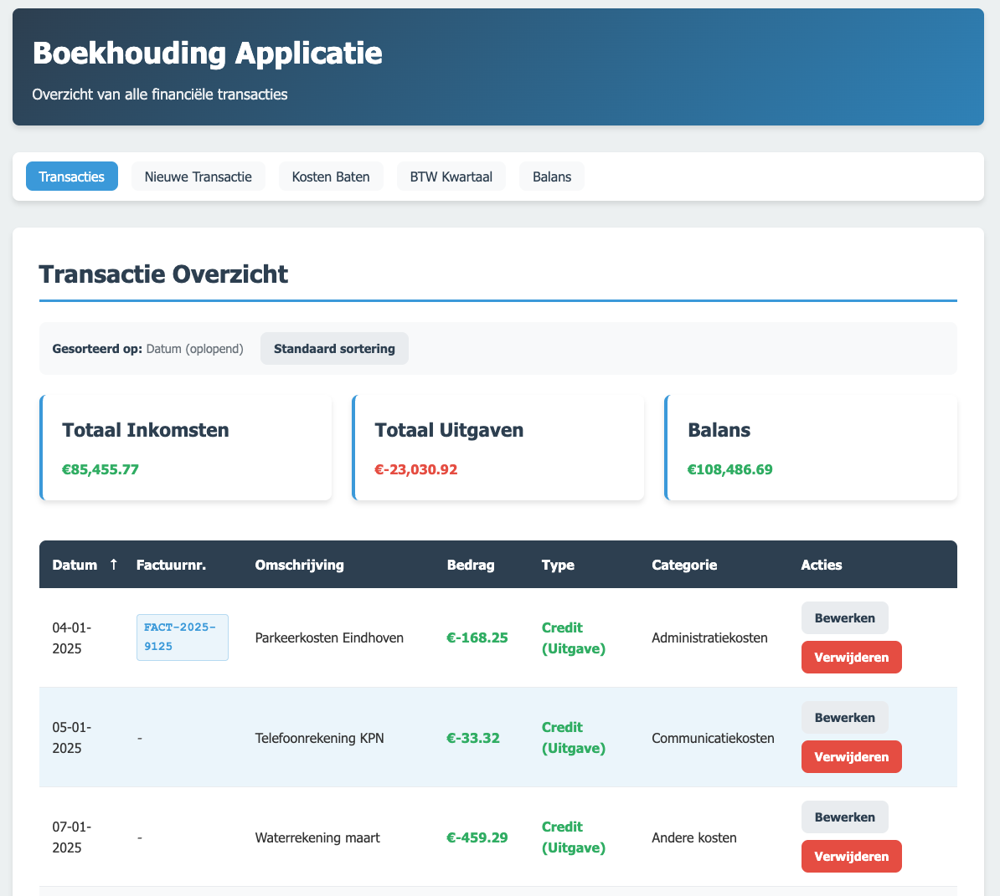
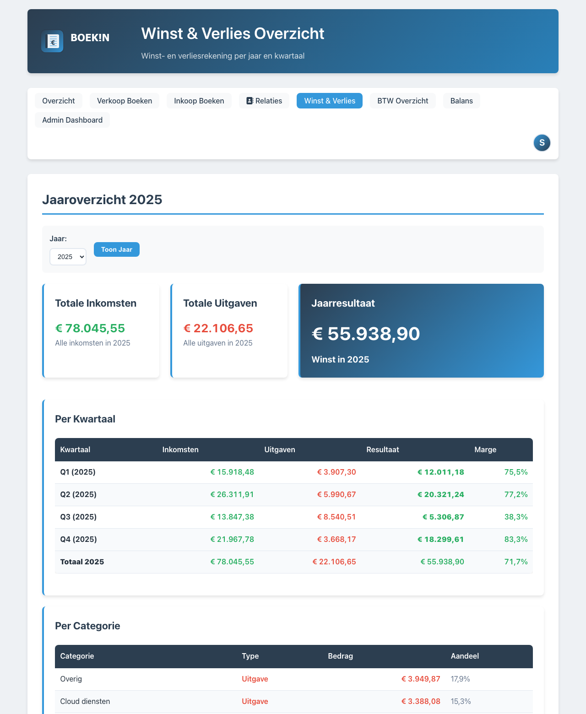
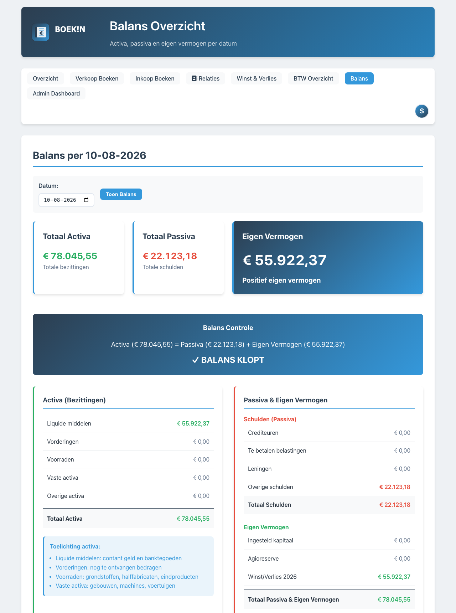
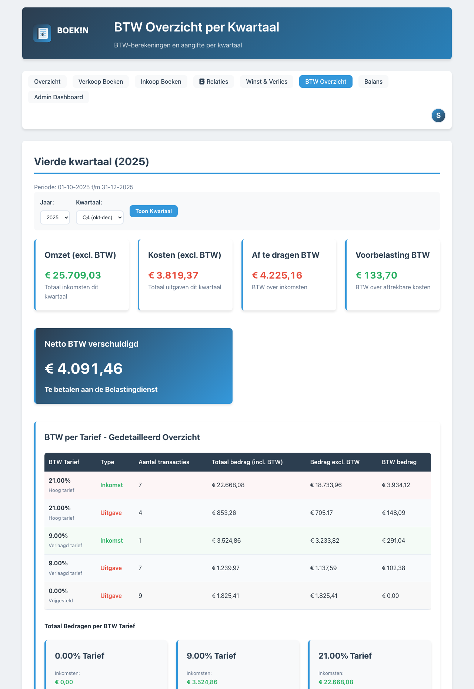

# boekhouden
Open source applicatie om administratie in te voeren.

## Installatie

Vereist: PHP 8.0 of nieuwer met `pdo_mysql`, en MySQL of MariaDB.

```bash
./setup.sh                          # database aanmaken en config schrijven
php -S localhost:8081 router.php    # app starten
```

Open daarna http://localhost:8081. Het setup-script toont aan het eind de
inloggegevens van de beheerder die het heeft aangemaakt.

Wil je de app eerst met fictieve cijfers bekijken, gebruik dan
`./setup.sh --with-sample-data` voor 130 voorbeeldtransacties over 2025.

Het script is idempotent: je kunt het opnieuw draaien om een bestaande
installatie bij te werken. Het maakt alleen aan wat ontbreekt en verwijdert
nooit gegevens. `./setup.sh --help` toont alle opties, zoals een afwijkende
databasenaam, gebruiker of wachtwoord.

Voor productie: zet de bestanden onder de document root van je webserver en
draai `./setup.sh` daar één keer. `php/config.php` wordt door het script
aangemaakt met rechten 600 en staat in `.gitignore`.

### Bonnetjes

Geuploade bonnetjes komen op het filesystem te staan, standaard in
`storage/receipts/`, met alleen het pad in de database. Ze zijn uitsluitend
op te vragen via `php/view_receipt.php`, dat eerst controleert of je ze mag
zien. De opslagmap zelf hoort niet rechtstreeks bereikbaar te zijn:

- **Apache** — geregeld door de meegeleverde `.htaccess` (vereist
  `AllowOverride All` in de vhost).
- **PHP-ontwikkelserver** — geregeld door `router.php`, dus start hem met
  `php -S localhost:8081 router.php` en niet zonder.
- **nginx** — leest geen `.htaccess`; voeg dit zelf toe:

  ```nginx
  location ^~ /storage/ { deny all; }
  ```

Wil je de bestanden liever helemaal buiten de webroot, zet dan `RECEIPT_DIR`
in `php/config.php` op een absoluut pad en zorg dat die map schrijfbaar is
voor de gebruiker waaronder PHP draait.

## Gebruik
- index.php: Overzicht van transacties
- add.php: Nieuwe transactie toevoegen
- edit.php: Transactie bewerken
- delete.php: Transactie verwijderen

[Bezoek Boekhouden met Fake data om uit te proberen](https://boekhouden.hodc.nl/)


## Voorbeeld
 - Onderstaande schermafbeeldingen geven een voorbeeld hoe de app werkt.
 - De voorbeelden zijn gebaseerd op Fake data.









